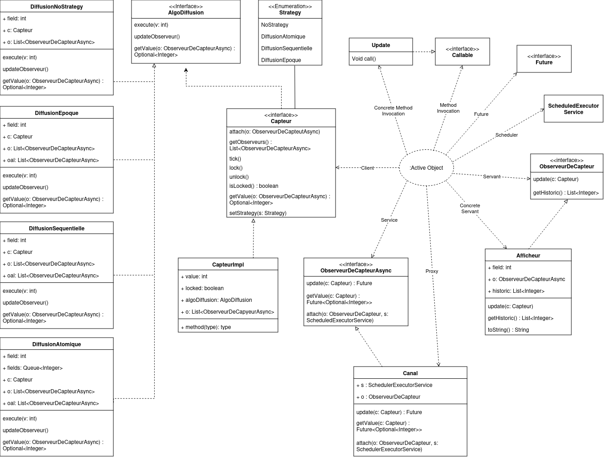
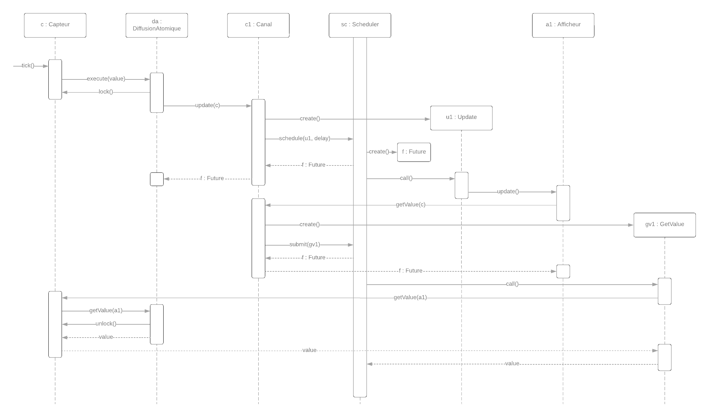
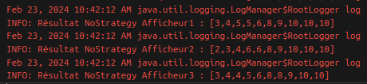
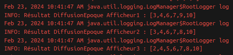
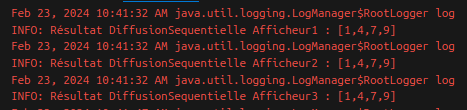
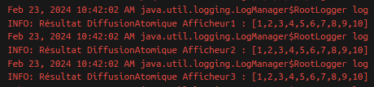

# ALP - Project
Réalisé par : GOMBERT Gwenaël - RIBEIRO GOMES Lise

## Introduction
Le but de ce projet est de réaliser un service de diffusion de données de capteur disposant de multiple choix de stratégies de diffusion synchrone et asynchrone. La structure de ce dernier s’appuit sur le patron de conception Active Object.

## Conception
Nous avons débuté ce projet par une phase de conception. Pour cela, nous avons réalisé un diagramme de classe, en utilisant le patron de conception Active Object.

Ainsi qu'un diagramme de séquence, ce dernier représente le déroulement du service de diffusion selon la stratégie atomique.

## Politiques de diffusion
En tout, trois types de diffusion sont implémentées :
- **Stratégie atomique :** les afficheurs doivent recevoir toutes les valeurs du capteur (sans doublon).
Le principe de la diffusion atomique est le suivant : le capteur délègue son travail à la stratégie. Cette dernière commence par enregistrer la valeur envoyée par le capteur, puis elle prévient les afficheurs qu'une nouvelle valeur est disponible. Elle attends que tous les afficheurs aient lu la valeur pour passer à la suivante. Cette méthode permet à tous les afficheurs d'obtenir la même suite de valeur, sans aucune valeur manquante.

- **Stratégie séquentielle :** les afficheurs doivent recevoir le même sous-ensemble de valeurs du capteur (sans doublon).
L'algorithme pour cette stratégie est très similaire à celui de la diffusion atomique. La principale différence étant que les valeurs ne sont pas gardées en mémoire. Si des valeurs sont envoyées par le capteur alors que la précedente valeur est toujours en cours de lecture, elle seront simplement oubliées. Avec cet algorithme, tous les afficheurs obtiennent la même suite de valeur, sans garantie d'obtenir toutes les valeurs.

- **Stratégie époque :** les afficheurs peuvent recevoir des sous ensembles de valeurs du capteur différents, mais il faut que ces sous-ensembles soient croissant (sans doublon).
Contrairement aux précedentes, la stratégie de diffusion époque ne repose pas sur la synchronisation. Les afficheurs sont prévenus à chaque nouvelle valeur et peuvent lire ces valeurs à tout moment. Cependant, dans cette stratégie, on vérifie si un afficheur a déjà lu la valeur courante, si c'est le cas, la valeur ne sera pas retournée afin de garantir l'absence de doublon. Avec cette algorithme, les afficheurs obtiennent des suites de valeurs strictement croissantes.

## Tests et résultats
Pour chaque tests, nous vérifions les conditions suivantes : 
- les valeurs reçues par les afficheurs sont inclues dans les valeurs transmises par le capteur.
- les résultats obtenus avec les stratégies ne possède aucun doublon.

### Sans stratégie
Les tests de diffusion de données sans stratégie font office de tests témoins afin d'être certain que la latence introduite ait bien un effet sur la transmission des valeurs.

### Diffusion Epoque
En plus des vérifications de bases, les tests pour la diffusion époque vérifient que les valeurs sont strictement croissantes.

### Diffusion Sequentielle
En plus des vérifications de bases, les tests pour la diffusion séquentielle vérifient que les afficheurs reçoivent le même sous-ensemble de valeurs du capteur.

### Diffusion Atomique
En plus des vérifications de bases, les tests pour la diffusion atomqique vérifient que les afficheurs reçoivent toutes les valeurs du capteur.

